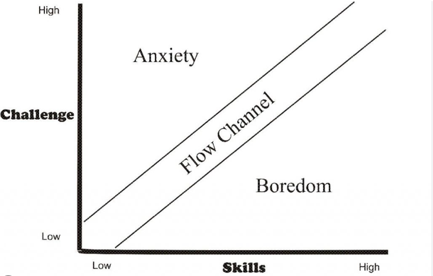

# Tutorials. 

For learning procedure -> link to the bottom

## Lesson 1: mmengine
This is the base library of OpenMMLab. 

### 1.1. Overview of mmengine
  - Installation
    - Setup: assignment
  - fundamental concepts 
    - runner
    - hooks
    - registry
    - configs
    - datasets: assignment
    - models: assignment
    - Hooks: assignment

### 1.2 mmengine specifics
  - visualization
  - logging: assignment
  - augmentation: assignment
  - Playing with learning rate scheduler: assignment
  - Putting it all together in a config file: assignment

## Lesson 2: mmdetection
Still need to plan this. 

## Lesson 3: mmsegmentation

## Lesson 4: mmdeploy

## Lesson 5: mmpose

## Lesson 6: mmrotate

## Lesson 7: mmtracking

# Learning procedure. 

Personally, I like to learn by doing. I always understand much better when I am debugging something. I do know a good amount of my friends who can understand a lot by just reading the code. 

I have gotten better at reading code, but I got there by writing a lot of code. 
So, this repository is built on the aim that it provides this flow like state for the beginners/intermediate developers when figuring out computer vision algorithms. The flow state is a blissful feeling when the learning has the correct amount of challenge for one's skill level. 

The above lessons are also designed to create a flow state for the user. If you do feel like some of the lessons are not challenging enough, you can always skip to the next lesson. I have tried to put tldr for each lesson, so people don't have to read the whole lesson if they don't want to.

So, if possible do stop at fun exercises and try to implement them yourself. You can always look at various tags which will take you to the assignment and the corresponding solution. 

