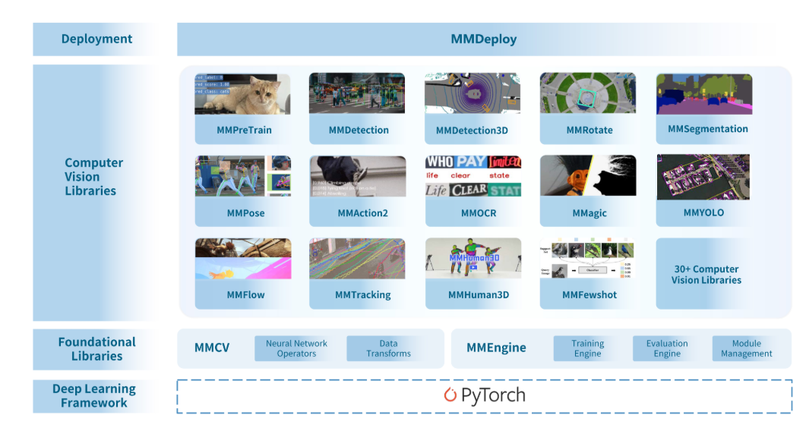

# Introduction

Everybody knows about [mmdetection](https://github.com/open-mmlab/mmdetection) which is a very vast opensource repo on different kinds of object detection models implemented in a very modular way. From some reddit posts(in the computer vision forums), people say the learning curve is a bit steep. When I was working on it, I understood the problem, making something modular comes with a good amount of complexity. Once the complexity is grasped, it becomes clear and the modular structure could be used to user's advantage to customize to a specific application. This blog series is what I missed when I was getting started with experimenting computer vision models in mmlab repos. A simple use case like bird detection/classification is used to explain different aspects of the mmlab repos. 

- Part 1: Understanding the basics: mmengine and the principles behind it. All the repos in mmlab are built on this. (Building a bird classification dataset)
- Part 2: MMDetection and utilizing it for bird detection. Also some datacapture with rpi5+camera.
- Part 3: Deployment. How to effeciently run the model in different medium, right from on the cloud to Jetson and rpi5. Quantizing the model to save costs when deploying on the cloud or to increase the speed on jetson or rpi5. 
- Part 4(Bonus): TBD

# Part 1: Simple classification problem with mmengine

A lot of the fundamental concepts are implemented in mmengine and these normally become the backbone for further mmlab repositories like mmsegmentation, mmdetection and mmpose. Often times, the base repo is skipped, however building a simple model using just this repo can explain the modular structure used in further repos. 

Just a small history on how repos like mmlab came into existence 

## Before computer vision was more of a researc topic
Around 2014-2018, the landscape was mostly filled with individual repos mostly published by researchers. Some of the prominent ones were yolo, faster-rcnn. And people used these repos with their data to solve their specific use-case. There were very little companies trying to build end to end computer vision platforms. The computer vision was still in its early research days back then. However, now with compute becoming less expensive, we do see some of the daily applications extensively use computer vision systems.  

## How the landscape changed
Soon, the landscape filled up with a lot of companies both open-source and closed-source helps in either one part of this pipeline or as an end to end solution. 
And one of these open source libs was from the OpenMMLab which released some amazing repos like mmdetection, mmpose, and many more. 

## Emergence of computer vision platforms
## OpenMMLab
The whole overview of mmlab can be best described in the picture below. 

There is a single base which acts as a backbone for all the other repos. The other repos expand on the base in terms or models, datasets, losses, metrics. The team has kept it very flexible for people to customize the models or any other parts of the code. This has often been the case since each application would require an application specific metric or an application specific visualization. 

## pre-requsites
- Need to know computer vision topics
- some familiarity in how deep learning works
- docker installed
- Most of this tutorial has been tested on linux(ubuntu 24.04), so not sure if there are problems on windows or mac. 

# Installation
This is something quite some people have faced problems with. Normally I believe it is quite hard to install the packages locally. They each do have different kinds of dependcies and it can be quite a hassle to deal with them. Either use the docker version from the repo, or try to build one for a specific repo. 

This repo provides one dockerfile which combines, mmengine, mmdetection, mmpose and mmsegmentation all in one environment. 

And the docker/podman usage is mostly described in the image below. 
There are two ways to go about it ->

Have the full installation as part of the docker image
If the repo is also hosted within, the user will have to make sure to push the code to remote

or have the environment and depencies as part of the docker image but the repos and installation is done in the container using a script. Keeps the docker image light. 
Here the repo could be a bind mount to the container and would keep the repo intact even if the container is killed. 

# mmengine 

## A simple example
Lets take a simple example of classification of birds dataset. The goal is to identify different bird species. Normally, this can be done with a very simple code. But the idea here is to make the code modular and follow patterns similar to mmengine. Constrainting ourselves this way gives a perspective on mmengine blocks and also helps in understanding further bigger repos. 

## Runner
This is the base of the any kind of training or testing or inference. 
Basically the main loop where all the important steps happen. It is best described by the image below from mmengine documentation. 

## Hooks

## Registry

As runner is the backbone, and hooks are these nice way for customizing the training process. Registry acts as a database of different modules available during the training process. 
It makes sure no explicit declaration is needed and can load modules at runtime, if they are present in the scope of the registry. What do I mean by scope? 

## mmengine template
The flow is to have all the repos within the working directory directly and overlay mmengine template on it. 
Why do I do that this way? Because this keeps my code separate from the mm_repos code. It makes it easier to debug and also change version later on, if I want a next version of a specific repo. 
And it makes it easier to share the codebase with others, because essentially only the overlay is shared. After a while, the org will itself have a good set of modules/classes which can be shared and easily tested. 

-> The tutorial follows this procedure from now on and it will try to push the user to write code in mmengine_custom and not in the repos directly. This can be hard initially but is considered one of the good practise. 

## Datsets

### Writing a dataset loader(Assignment 1.1)

## Model

### Writing a simple model(1.2)

## Visualization

### Writing a custom hook and visualizer(Assignment 1.3)

## Metrics

### Writing a simple metric(Assignment 1.1.4)

# Putting it all together

# Conclusion

